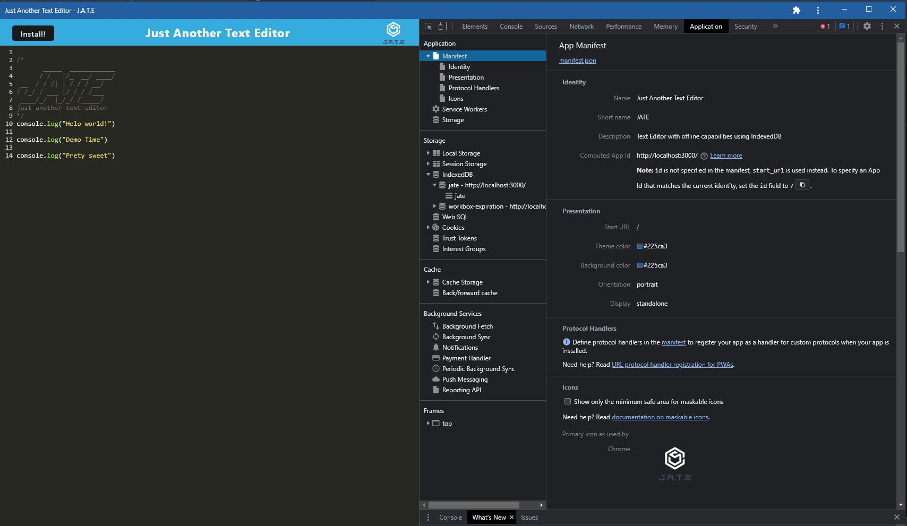

# Text-Editor

## Description 

This is a simple text editor app that can function both online and offline. The application uses the data in the indexedDB to populate the editor. Then if it cannot access that it will use local storage. For use offline, this application can be downloaded to your desktop as an application. This application is helpful to developers and QA because they can use this as a scratch pad for code snippets and coding ideas or test cases.

## Content

* [Installation](#installation)
* [Usage](#usage)
* [Packages](#packages)
* [Screenshots](#screenshots)
* [License](#license)

## Installation

To install the application, the user simply needs to clone the repository and then run the command "npm install". This will install all necessary dependencies since they are all included in the package.json. 

## Usage
To use this application, open it up in the browser by clicking on the link (https://text-editor-sz.herokuapp.com/) and then you are good to go. For offline use, the user can go to the link and hit the "install" button at the top left corner of the page.

## Packages

* [HTML](https://developer.mozilla.org/en-US/docs/Web/HTML)
* [CSS](https://developer.mozilla.org/en-US/docs/Web/CSS)
* [Javascript](https://developer.mozilla.org/en-US/docs/Web/Javascript)
* [NodeJS](https://nodejs.org/en/)
* [ExpressJS](https://expressjs.com/)

## Screenshots

MIT License

Copyright (c) 2023 SerhiyZv

Permission is hereby granted, free of charge, to any person obtaining a copy
of this software and associated documentation files (the "Software"), to deal
in the Software without restriction, including without limitation the rights
to use, copy, modify, merge, publish, distribute, sublicense, and/or sell
copies of the Software, and to permit persons to whom the Software is
furnished to do so, subject to the following conditions:

The above copyright notice and this permission notice shall be included in all
copies or substantial portions of the Software.

THE SOFTWARE IS PROVIDED "AS IS", WITHOUT WARRANTY OF ANY KIND, EXPRESS OR
IMPLIED, INCLUDING BUT NOT LIMITED TO THE WARRANTIES OF MERCHANTABILITY,
FITNESS FOR A PARTICULAR PURPOSE AND NONINFRINGEMENT. IN NO EVENT SHALL THE
AUTHORS OR COPYRIGHT HOLDERS BE LIABLE FOR ANY CLAIM, DAMAGES OR OTHER
LIABILITY, WHETHER IN AN ACTION OF CONTRACT, TORT OR OTHERWISE, ARISING FROM,
OUT OF OR IN CONNECTION WITH THE SOFTWARE OR THE USE OR OTHER DEALINGS IN THE
SOFTWARE.